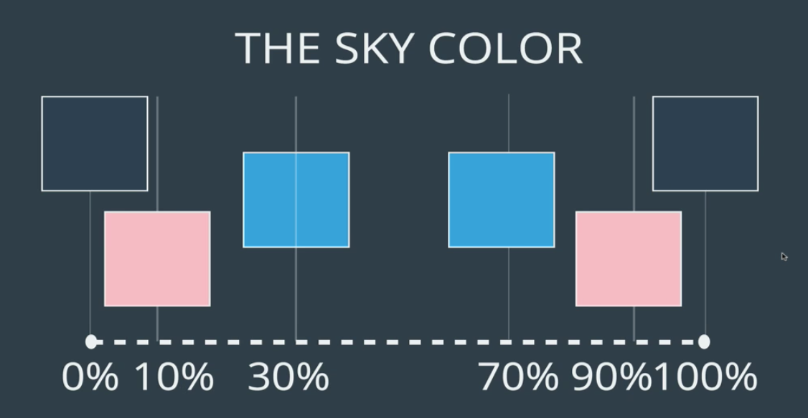
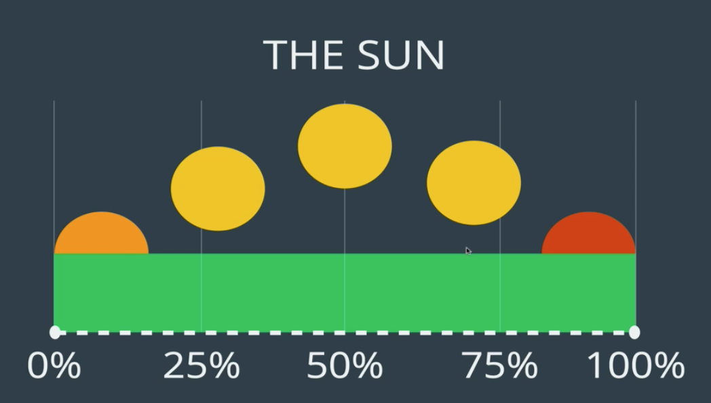

# Sun and Sky animation
This fun little project demonstrates moving the sun across the sky from sun rise to sunset.

The percentages are for use with css keyframes.

## The Sky
Below are the colors the sky should transition to during the animation.

## The Sun
Below shows the position of the sun and its color during the animation. 

